# CAPAROC 控制程式流程圖

> **文檔版本**: v1.0  
> **最後更新**: 2025-11-13  
> **對應程式**: caparoc_controller.py v3.7

本文檔使用 Mermaid 語法繪製流程圖，可在支援 Mermaid 的 Markdown 檢視器中查看。

---

## 📚 目錄

1. [主程式啟動流程](#1-主程式啟動流程)
2. [標稱電流設定流程](#2-標稱電流設定流程)
3. [通道控制流程](#3-通道控制流程)
4. [即時監控流程](#4-即時監控流程)
5. [重連機制流程](#5-重連機制流程)
6. [Assembly 通訊架構](#6-assembly-通訊架構)

---

## 1. 主程式啟動流程

### 1.1 完整啟動流程

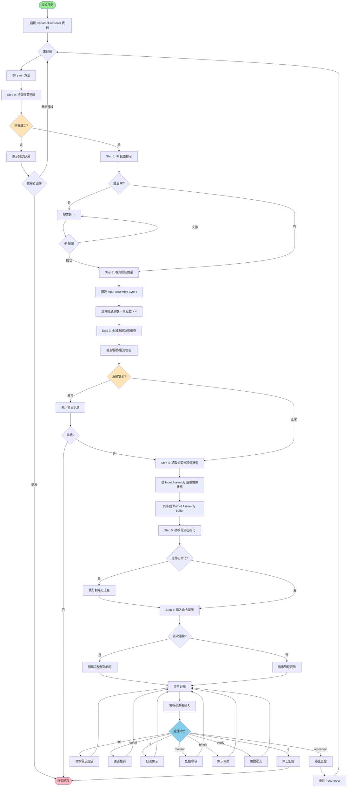

### 1.2 連線檢查詳細流程

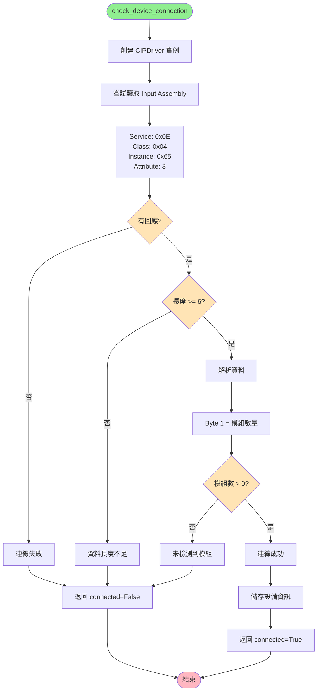

---

## 2. 標稱電流設定流程

### 2.1 Parameter Object 5 步驟方法

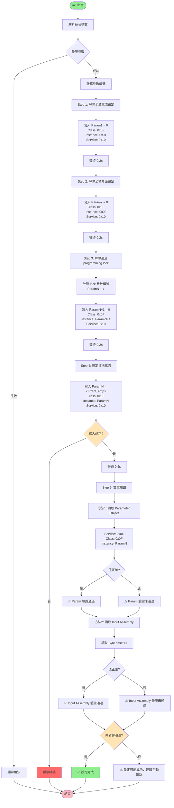

### 2.2 參數編號計算

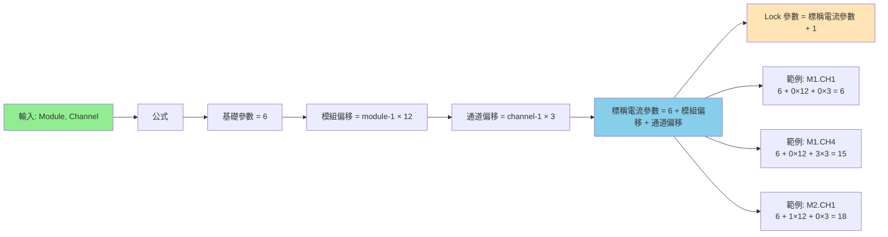

---

## 3. 通道控制流程

### 3.1 on/off 命令處理

```mermaid
flowchart TD
    Start([on/off 命令]) --> Parse[解析通道編號]
    Parse --> CheckInit{已初始化?}
    
    CheckInit -->|否| Error1[錯誤: 請先初始化]
    Error1 --> End([結束])
    
    CheckInit -->|是| CalcBit[計算位元位置]
    CalcBit --> BitPos[byte_offset = 1<br/>bit_position = channel - 1]
    
    BitPos --> GetCurrent[讀取當前 Byte 1 值]
    GetCurrent --> DoBitOp{開啟或關閉?}
    
    DoBitOp -->|開啟| SetBit[new_value = current | 1 << bit]
    DoBitOp -->|關閉| ClearBit[new_value = current & ~1 << bit]
    
    SetBit --> UpdateBuffer
    ClearBit --> UpdateBuffer
    
    UpdateBuffer[更新 output_data buffer]
    UpdateBuffer --> WriteAssembly[寫入 Output Assembly]
    
    WriteAssembly --> WriteMsg[Service: 0x10<br/>Class: 0x04<br/>Instance: 0x64<br/>Attribute: 3<br/>Data: 18 bytes]
    WriteMsg --> Wait[等待 0.5s]
    
    Wait --> ReadResult[讀取驗證結果]
    ReadResult --> ReadInput[從 Input Assembly<br/>讀取實際狀態與電流]
    ReadInput --> ShowResult[顯示控制結果]
    ShowResult --> End
    
    style Start fill:#90EE90
    style End fill:#FFB6C1
    style CheckInit fill:#FFE4B5
    style DoBitOp fill:#FFE4B5
```

### 3.2 Byte 1 位元操作圖解

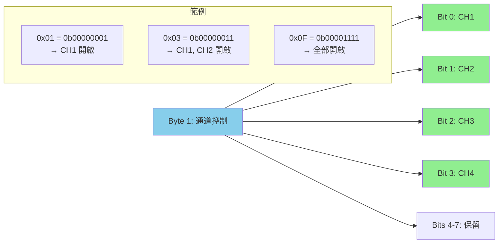

---

## 4. 即時監控流程

### 4.1 監控啟動與運作

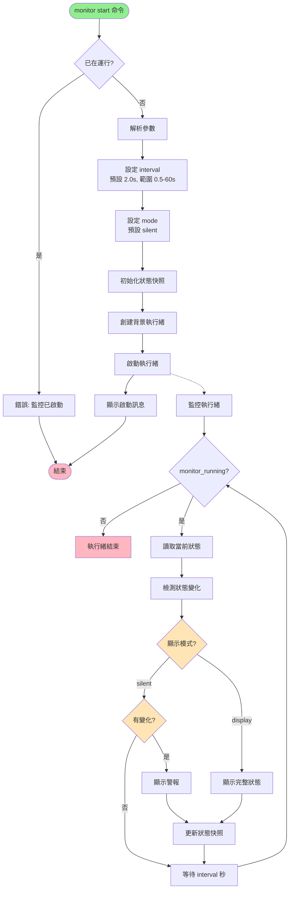

### 4.2 變化檢測機制

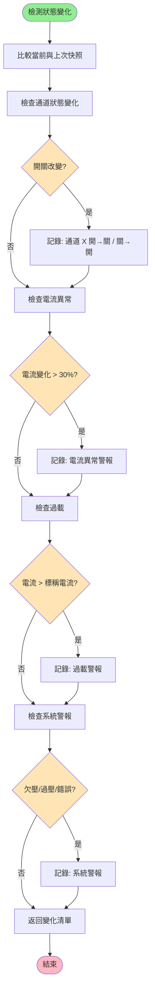

---

## 5. 重連機制流程

### 5.1 重連觸發與處理

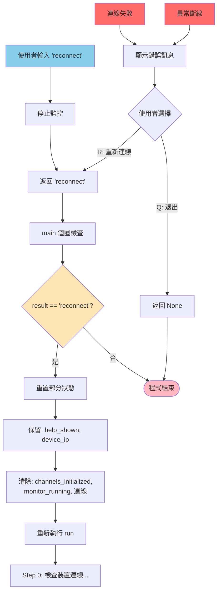

### 5.2 幫助信息顯示邏輯

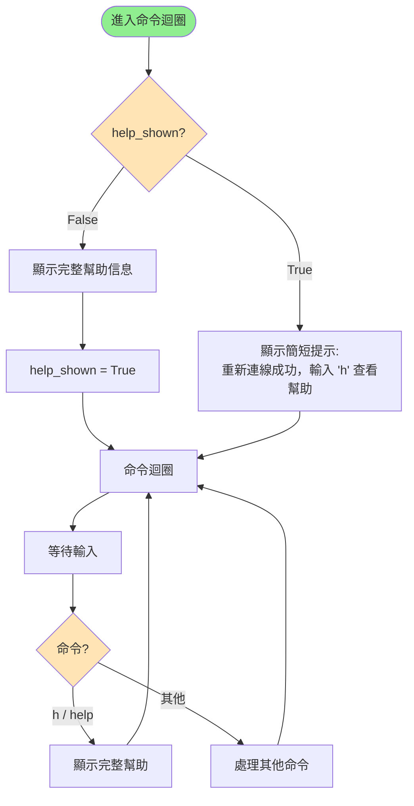

---

## 6. Assembly 通訊架構

### 6.1 三種 Assembly 關係

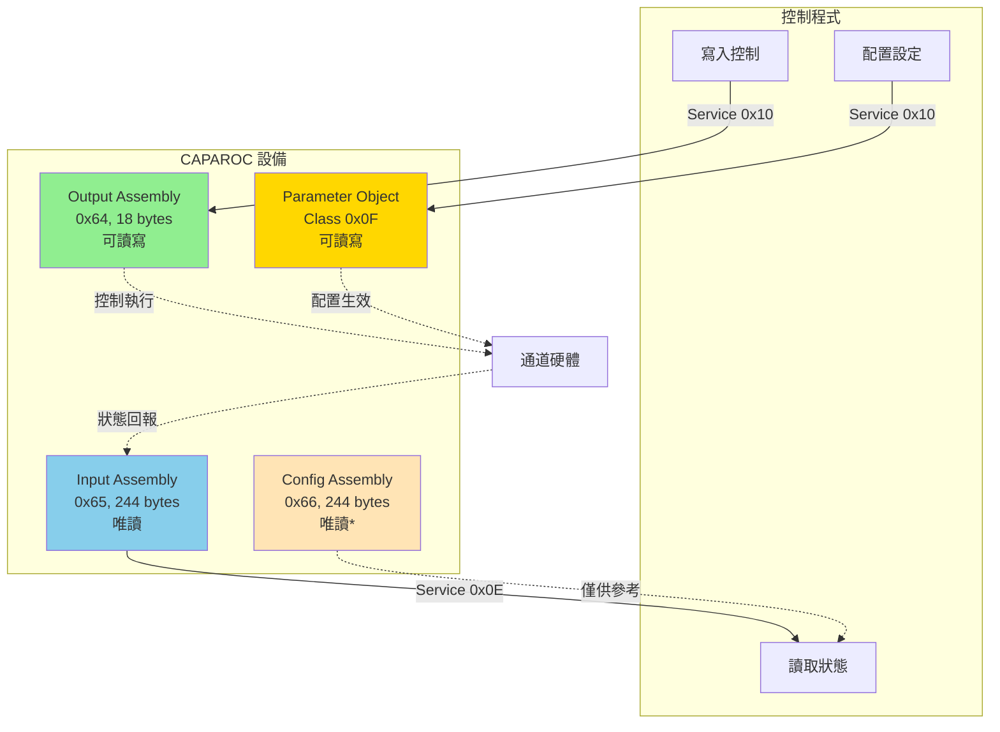

### 6.2 Input Assembly 資料結構

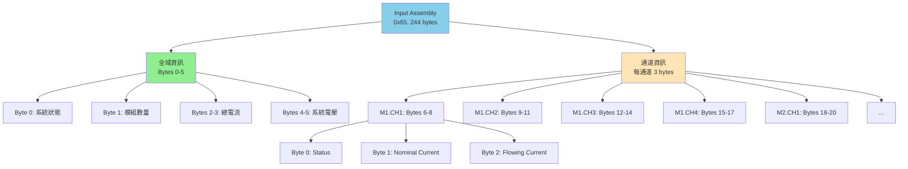

### 6.3 通訊服務代碼

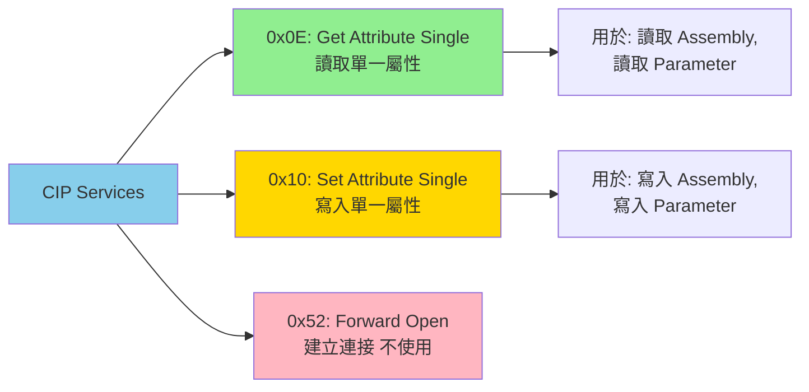

---

## 📊 流程圖圖例


**說明**:
- 🟢 綠色: 開始/結束/成功
- 🔵 藍色: 一般處理步驟
- 🟡 黃色: 判斷條件/警告
- 🔴 紅色: 錯誤/失敗
- 🟠 橙色: 重要節點

---

## 📝 使用說明

### 如何檢視 Mermaid 圖表

1. **GitHub**: 直接在 GitHub 上檢視此檔案，自動渲染
2. **VS Code**: 安裝 "Markdown Preview Mermaid Support" 擴展
3. **在線工具**: 複製到 [Mermaid Live Editor](https://mermaid.live/)
4. **其他編輯器**: 尋找支援 Mermaid 的 Markdown 預覽外掛

### 相關文檔

- [主程式流程詳解](MAIN_PROGRAM_FLOW.md) - 文字版完整說明
- [診斷工具指南](DIAGNOSTIC_TOOLS_GUIDE.md) - 診斷工具使用
- [CLI 使用指南](CLI_USER_GUIDE.md) - 命令列操作指南

---

**文檔結束**
